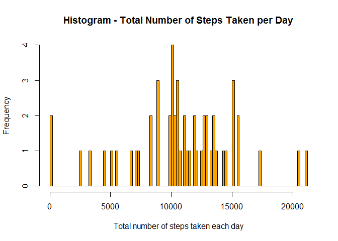
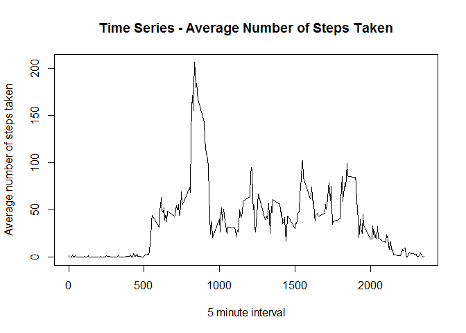

# PeerAssessment1
Rick Hutchison  
December 18, 2015  

This is an R Markdown document for the completion of the Peer Assessment 1 assignment for Reproducable Research class in December 2015.

From the assignment:

"This assignment makes use of data from a personal activity monitoring device. This device collects data at 5 minute intervals through out the day. The data consists of two months of data from an anonymous individual collected during the months of October and November, 2012 and include the number of steps taken in 5 minute intervals each day."

Load the activity data:


```r
act <- read.csv("./activity.csv")
summary(act)
```

```
##      steps                date          interval     
##  Min.   :  0.00   2012-10-01:  288   Min.   :   0.0  
##  1st Qu.:  0.00   2012-10-02:  288   1st Qu.: 588.8  
##  Median :  0.00   2012-10-03:  288   Median :1177.5  
##  Mean   : 37.38   2012-10-04:  288   Mean   :1177.5  
##  3rd Qu.: 12.00   2012-10-05:  288   3rd Qu.:1766.2  
##  Max.   :806.00   2012-10-06:  288   Max.   :2355.0  
##  NA's   :2304     (Other)   :15840
```

Histogram of the total number of steps taken each day:


```r
stepsum <- aggregate(steps~date, data=act, FUN=sum, na.rm=TRUE)
hist(stepsum$steps,
     breaks=100,
     col='orange',
     main="Histogram - Total Number of Steps Taken per Day",
     xlab="Total number of steps taken each day")
```

 

The mean total number of steps taken per day:


```r
mean(stepsum$steps, na.rm = TRUE)
```

```
## [1] 10766.19
```

The median total number of steps taken per day:


```r
median(stepsum$steps, na.rm = TRUE)
```

```
## [1] 10765
```

Average daily activity pattern:


```r
stepmean <- aggregate(steps~interval, data=act, FUN=mean, na.rm=TRUE)
plot(stepmean,
     type="l",
     main="Time Series - Average Number of Steps Taken",
     xlab="5 minute interval",
     ylab="Average number of steps taken")
```

 

The interval with the maximum number of steps is:


```r
library(data.table)
sm <- as.data.table(stepmean)
sm[which.max(sm$steps)]
```

```
##    interval    steps
## 1:      835 206.1698
```

Total number of missing values:


```r
sum(is.na(act))
```

```
## [1] 2304
```

Create a dataset with the NA values replaced with the mean for that 5 minute interval


```r
act2 <- as.data.table(act)
act2[,steps := as.double(steps)]
act2[is.na(steps), steps := stepmean[stepmean$interval == interval, "steps"]]
```

Histogram of the total number of steps taken each day with missing data filled in:


```r
stepsum2 <- aggregate(steps~date, data=act2, FUN=sum, na.rm=TRUE)
hist(stepsum2$steps,
     breaks=100,
     col='orange',
     main="Histogram - Total Number of Steps Taken per Day",
     xlab="Total number of steps taken each day")
```

 

The mean total number of steps taken per day:


```r
mean(stepsum2$steps, na.rm = TRUE)
```

```
## [1] 10766.19
```

The median total number of steps taken per day:


```r
median(stepsum2$steps, na.rm = TRUE)
```

```
## [1] 10765.59
```

Add a day type column to the data set with the missing values filled in.  Replace the day of the week value returned by weekday to "weekend" if Saturday or Sunday, otherwise "weekday"


```r
act2$daytype <- weekdays(as.Date(act2$date))
act2[daytype == "Saturday", daytype := "weekend"]
act2[daytype == "Sunday", daytype := "weekend"]
act2[daytype != "weekend", daytype := "weekday"]
```

Time series panel plot of after number of steps taken, averaged across all weekday days or weekend days by interval.


```r
act3 <- aggregate(steps~interval+daytype, data=act2, FUN=mean, na.rm=TRUE)

library(lattice)

xyplot(steps~interval|daytype,
       data=act3,
       type="l",
       xlab="Interval",
       ylab="Number of steps",
       layout=c(1,2))
```

 


